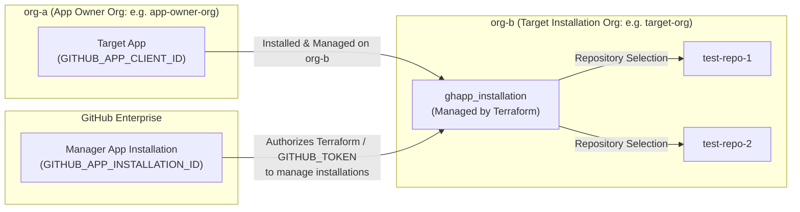

# Developer Onboarding & Environment Bootstrap Guide

This guide provides exhaustive step-by-step instructions for setting up your local development environment, bootstrapping GitHub Enterprise credentials, and running both offline table-driven unit tests and live `TF_ACC=1` acceptance tests for `terraform-provider-gh-app-unofficial`.

---

## 1. Prerequisites & Toolchain Setup

To contribute to or debug the provider, ensure the following core tools are installed on your machine:
- **[Go](https://golang.org/doc/install)** >= 1.24
- **[Terraform CLI](https://developer.hashicorp.com/terraform/downloads)** >= 1.0
- **Make** (`GNUmakefile`)
- **[VS Code](https://code.visualstudio.com/)** with the [Go Extension](https://marketplace.visualstudio.com/items?itemName=golang.Go)
- **Delve Debugger** (`dlv`):
  ```shell
  go install github.com/go-delve/delve/cmd/dlv@latest
  ```

---

## 2. Bootstrapping the Dual-App Architecture

Acceptance testing (`make testacc` / CI) and interactive debugging (`dlv`) require credentials for **two distinct GitHub Apps** operating across a clear two-organization structure under a GitHub Enterprise Cloud or Server account (`GITHUB_ENTERPRISE_SLUG`).

### 2.1 The Two-Organization Structure (`org-a` vs. `org-b`)
To cleanly verify organization installation lifecycles (`ghapp_installation`), our workflow separates the organization where the Target App is owned (`org-a`) from the target sandbox organization where the app is installed and tested (`org-b`):
- **`org-a` (App Owner Organization, e.g., `app-owner-org`):** The organization where the **Target App** (`GITHUB_APP_CLIENT_ID`) is registered and owned.
- **`org-b` (Target Installation Organization, e.g., `target-org` / `GITHUB_TARGET_ORG`):** The dedicated static sandbox organization where the **Target App** is installed, updated, and uninstalled by our Terraform provider, and where our static fixture repositories (`test-repo-1`, `test-repo-2`) reside.



### 2.2 Pre-Provisioning `org-b` (`target-org`)
Inside **`org-b` (`GITHUB_TARGET_ORG`)**, create two permanent test repositories initialized with a `README.md`:
- `test-repo-1`
- `test-repo-2`

### 2.3 The Manager App (Enterprise Installation Manager)
The Manager App is an enterprise-scoped GitHub App configured with `Enterprise Organization Installations: Read & write` permissions. It grants Terraform the administrative authority required to install, update, and uninstall target GitHub Apps on organizations (`org-b`) across the enterprise.

During local acceptance testing (`make testacc`) and debugging (`dlv`), `cmd/get-token` serves as a convenience utility that exchanges the Manager App's credentials for an installation access token (`GITHUB_TOKEN`). (Note that obtaining the token via `cmd/get-token` is optional; any valid token with enterprise installation management permissions can be used.)

1. Navigate to your GitHub Enterprise Settings -> **GitHub Apps** -> **New GitHub App**.
2. Set up required permissions:
   - **Enterprise Permissions** -> **Enterprise Organization Installations**: `Read & write`.
3. Generate and download a Private Key (`.pem` file).
4. Install the Manager App at the **Enterprise level** (under Enterprise Settings -> Installed GitHub Apps) so its access token is authorized for `/enterprises/{enterprise}/...` API endpoints.
5. Record:
   - `GITHUB_APP_ID`: The numeric App Client ID / Issuer ID of the Manager App.
   - `GITHUB_APP_PRIVATE_KEY_PATH`: Full file path to the downloaded private key file (e.g. `~/keys/manager.pem` or `manager.pem`), including the filename.
   - `GITHUB_APP_INSTALLATION_ID`: The numeric ID of the Manager App's installation at the Enterprise level.

### 2.4 The Target App (`org-a`)
The Target App is the child application owned inside `org-a` (`app-owner-org`) whose installations on `org-b` (`target-org`) are created, updated, and deleted by Terraform (`ghapp_installation`) during acceptance tests or debugging sessions.

1. Create a GitHub App inside **`org-a` (`app-owner-org`)**.
2. Set up required permissions:
   - **Repository Permissions** -> **Metadata**: `Read-only` (mandatory default permission for GitHub Apps).
3. Ensure the app settings allow installation on other organizations (or any organization within your enterprise).
4. Record its Client ID (`GITHUB_APP_CLIENT_ID`).

---

## 3. Local Environment Configuration (`.env`)

To avoid duplicating environment variables, our build tooling (`make testacc`) automatically inherits `GITHUB_ENTERPRISE_SLUG`, `GITHUB_TARGET_ORG`, and `GITHUB_APP_CLIENT_ID` directly from your `TF_VAR_*` variables. You only need a minimal, clean `.env` file in the workspace root:

```env
# Manager App Credentials (for dynamic JWT authentication via cmd/get-token targeting org-b)
GITHUB_APP_ID="3875173"
GITHUB_APP_PRIVATE_KEY_PATH="~/keys/manager.pem"
GITHUB_APP_INSTALLATION_ID="135885315"

# Target example directory for debugging
TF_EXAMPLE_DIR="examples/resources/ghapp_installation"

# Unified variables used seamlessly across both VS Code debugging (dlv) and make testacc
TF_VAR_enterprise_slug="my-test-enterprise"
TF_VAR_target_org="target-org"
TF_VAR_client_id="Iv1.abc123mock456xyz"
TF_VAR_repository_selection="selected"
TF_VAR_selected_repositories='["test-repo-1", "test-repo-2"]'
```

> [!NOTE]
> **Why CI uses `GH_` instead of `GITHUB_`:** GitHub Actions strictly reserves the `GITHUB_` prefix for system-defined environment variables and secrets (like `GITHUB_TOKEN`, `GITHUB_ACTOR`). Because GitHub blocks creating custom repository secrets and variables starting with `GITHUB_`, our automated CI workflow (`.github/workflows/acceptance.yml`) uses the `GH_` prefix (`GH_APP_ID`, `GH_APP_PRIVATE_KEY`, `GH_ENTERPRISE_SLUG`, etc.), while local `.env` execution (`make testacc`) uses standard `GITHUB_*` environment variables.

---

## 4. Unified Operating Model

Both local interactive debugging (`dlv` / VS Code `F5`) and automated acceptance testing (`make testacc`) target the exact same static sandbox organization (`GITHUB_TARGET_ORG` / `org-b`) and pre-provisioned repositories (`test-repo-1`, `test-repo-2`):

| Category | Manual Debugging & Dev Mode (`dlv` / VS Code F5) | Automated Acceptance Testing (`make testacc` / CI) |
| :--- | :--- | :--- |
| **Purpose** | Interactive development, attaching breakpoints (`dlv`) to local HCL examples (`examples/resources/ghapp_installation`). | Automated, non-interactive CI/CD validation and regression testing against the static sandbox. |
| **Target Organization (`org-b`)** | Static dedicated organization (`TF_VAR_target_org` / `GITHUB_TARGET_ORG` in `.env`). | Static dedicated organization (`GITHUB_TARGET_ORG`). Pre-check verifies required environment variables are configured. |
| **App Authentication** | Uses `GITHUB_APP_ID`, `GITHUB_APP_PRIVATE_KEY_PATH`, and `GITHUB_APP_INSTALLATION_ID` in `.env` to authenticate. | Uses `GITHUB_APP_ID`, `GITHUB_APP_PRIVATE_KEY_PATH`, and `GITHUB_APP_INSTALLATION_ID` via `cmd/get-token`. |
| **HCL Input Variables** | Uses `TF_VAR_enterprise_slug`, `TF_VAR_target_org`, `TF_VAR_client_id`, and `TF_EXAMPLE_DIR`. | Controlled entirely by Go test strings (`testAccConfig`); ignores `TF_VAR_*` variables. |

---

## 5. Executing Tests Locally

### 5.1 Fast Offline Unit Tests (`go test ./...`)
Unit tests execute entirely offline via injected `roundTripperFunc` and `httptest.Server` mocks. They require **zero external credentials or network connections** and run in under 2 seconds:

```shell
go test -v -race -shuffle=on -cover ./...
```

### 5.2 Live Acceptance Tests (`make testacc`)
Acceptance tests exercise real GitHub Enterprise endpoints against your static sandbox organization (`org-b`):

```shell
make testacc
```

When `make testacc` runs:
1. `cmd/get-token` parses `.env`, signs an RS256 JWT using `GITHUB_APP_PRIVATE_KEY_PATH`, and exports an authenticated `GITHUB_TOKEN` scoped to `org-b`.
2. `testAccPreCheck` verifies that all required environment variables (`GITHUB_TOKEN`, `GITHUB_ENTERPRISE_SLUG`, `GITHUB_TARGET_ORG`, `GITHUB_APP_CLIENT_ID`) are configured before running live tests.
3. Automated sweepers (`sweepInstallations` via `-sweep=all`) query enterprise installations via `client.Enterprise.ListAppInstallations` and cleanly uninstall any existing installations matching `GITHUB_APP_CLIENT_ID` before tests begin.
4. `TestAccInstallationResource` executes the exhaustive 9-step sequence (`Create` -> `PlanOnly` -> `ImportState` -> `Update` swap -> `PlanOnly` -> `Update` multi -> `Update` `"all"` -> `PlanOnly` -> `Destroy`).
5. Upon suite completion, `terraform destroy` cleanly uninstalls the Target App from `GITHUB_TARGET_ORG` (`org-b`), returning the organization to a pristine state for the next run.

---

## 6. Interactive VS Code Debugging (`F5` / `dlv`)

### 6.1 Configuring Dev Overrides (`terraform.rc`)
Create a `terraform.rc` file in the workspace root pointing to your local Go binary directory (`~/go/bin`):

```hcl
provider_installation {
  dev_overrides {
    "google/gh-app-unofficial" = "/path/to/your/home/go/bin"
  }
  direct {}
}
```

### 6.2 Debugging with Breakpoints
1. Open the **Run and Debug** view (`Ctrl+Shift+D`) in VS Code.
2. Select **`Debug Provider`** and press `F5`.
3. Choose the Terraform command (`plan`, `apply`, or `destroy`) from the dropdown prompt.
4. Switch to the **Terminal** tab (`Start Headless Debugger`), and press **`ENTER`** to run Terraform against your target HCL directory (`TF_EXAMPLE_DIR`). Your breakpoints inside `internal/provider/*.go` will now trigger cleanly.

---

## 7. Organization Maintenance Runbook

Because the **Streamlined Static Sandbox Architecture** does not dynamically create or delete organizations or repositories, maintaining the test environment requires zero cleanup scripts or super-admin site permissions.

If rotating to new organizations or renewing an enterprise trial:
1. Create or designate two organizations: `org-a` (`app-owner-org`) and `org-b` (`target-org`).
2. Inside `org-a` (`app-owner-org`), create the Target App and note its Client ID (`GITHUB_APP_CLIENT_ID`). Ensure it is installable on `org-b`.
3. Inside `org-b` (`target-org`), initialize two repositories (`test-repo-1` and `test-repo-2`).
4. Install the Manager App (`GITHUB_APP_ID`) onto `org-b` (`target-org`) with App/Org administration permissions and note its Installation ID (`GITHUB_APP_INSTALLATION_ID`).
5. Update `.env` locally or GitHub Actions Repository Secrets/Variables (`GH_APP_ID`, `GH_APP_INSTALLATION_ID`, `GH_APP_CLIENT_ID`, `GH_APP_TEST_ENTERPRISE`, `GH_APP_TEST_ORG`, `GH_APP_PRIVATE_KEY`).
