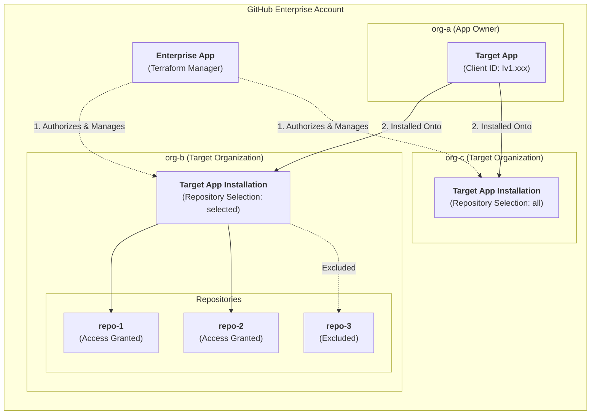
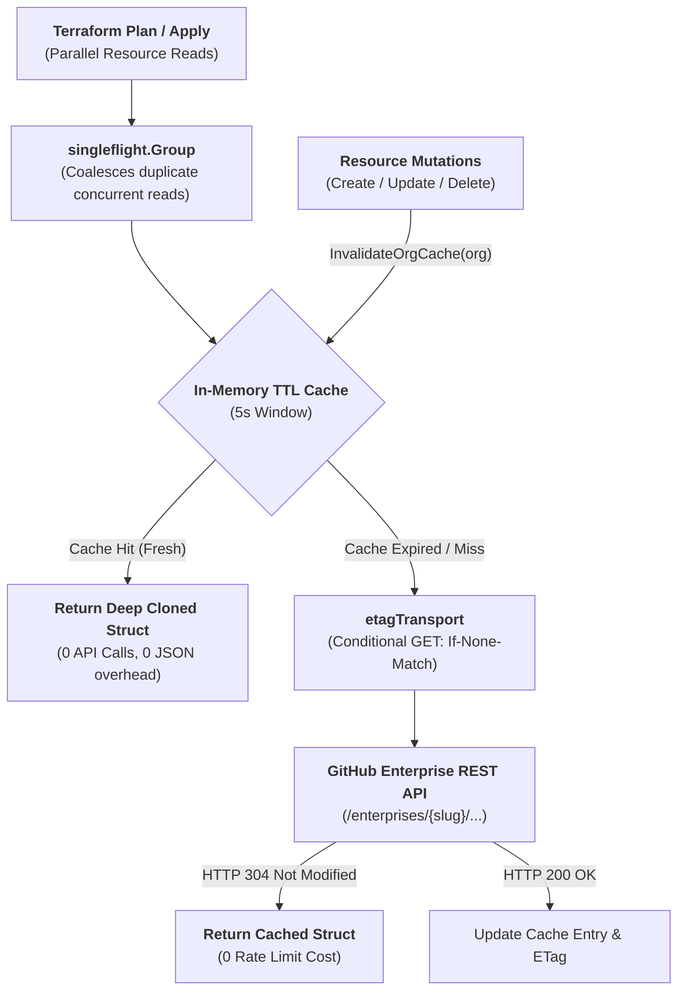

# Local Development & Contributor Guide

This guide provides comprehensive, step-by-step instructions for setting up your local environment, understanding the dual-app testing architecture, executing offline unit tests and live acceptance tests, debugging the provider interactively with Delve and VS Code, and understanding the core provider runtime engine.

---

## 1. Prerequisites & Toolchain Setup

Ensure the following tools are installed on your workstation:

- **[Go](https://golang.org/doc/install)** >= 1.25
- **[Terraform CLI](https://developer.hashicorp.com/terraform/downloads)** >= 1.0
- **GNU Make** (`make`)
- **[VS Code](https://code.visualstudio.com/)** with the [Go Extension](https://marketplace.visualstudio.com/items?itemName=golang.Go)
- **Delve Debugger** (`dlv`):
  ```shell
  go install github.com/go-delve/delve/cmd/dlv@latest
  ```

---

## 2. Quick Reference: Common Makefile Commands

| Command | Action | Description |
| :--- | :--- | :--- |
| `make build` | Build | Compiles all packages in the workspace. |
| `make install` | Install | Compiles and installs provider binary to `$GOPATH/bin`. |
| `make fmt` | Format | Formats all Go source code using `gofmt -s -w -e .`. |
| `make lint` | Lint | Executes `golangci-lint run` against codebase. |
| `make generate` | Generate Docs | Uses `tfplugindocs` to regenerate documentation in `docs/`. |
| `make test` | Unit Tests | Runs fast offline unit tests with race detector and coverage. |
| `make testacc` | Acceptance Tests | Runs live end-to-end acceptance tests against GitHub sandbox. |

---

## 3. Dual-App Testing Architecture

Acceptance testing (`make testacc` / CI) and interactive debugging (`dlv`) require credentials for **two distinct GitHub Apps** operating across a two-organization structure under a GitHub Enterprise account (`GITHUB_ENTERPRISE_SLUG`).

### 3.1 Two-Organization Model (`org-a` vs. `org-b`)

To cleanly verify organization installation lifecycles (`gh-app-unofficial_installation`), our testing workflow separates the organization where the Target App is owned (`org-a`) from the target sandbox organization where the app is installed and managed (`org-b`):

- **`org-a` (App Owner Organization, e.g., `app-owner-org`):** The organization where the **Target App** (`GITHUB_APP_CLIENT_ID`) is registered and owned.
- **`org-b` (Target Installation Organization, e.g., `target-org` / `GITHUB_TARGET_ORG`):** The dedicated static sandbox organization where the **Target App** is installed, updated, and uninstalled by Terraform, and where fixture test repositories (`test-repo-1`, `test-repo-2`) reside.



### 3.2 Pre-Provisioning Fixture Repositories (`org-b`)

Inside **`org-b` (`GITHUB_TARGET_ORG`)**, create two permanent test repositories initialized with a `README.md`:
- `test-repo-1`
- `test-repo-2`

### 3.3 The Manager App (Enterprise Installation Manager)

The Manager App is an enterprise-scoped GitHub App configured with `Enterprise Organization Installations: Read & write` permissions. It grants Terraform the administrative authority required to install, update, and uninstall target GitHub Apps on organizations (`org-b`) across the enterprise.

1. Navigate to your GitHub Enterprise Settings -> **GitHub Apps** -> **New GitHub App**.
2. Configure required permissions:
   - **Enterprise Permissions** -> **Enterprise Organization Installations**: `Read & write`.
3. Generate and download a Private Key (`.pem` file).
4. Install the Manager App at the **Enterprise level** (Enterprise Settings -> Installed GitHub Apps) so its access token is authorized for `/enterprises/{enterprise}/...` API endpoints.
5. Record:
   - `GITHUB_APP_ID`: Numeric App ID of the Manager App.
   - `GITHUB_APP_PRIVATE_KEY_PATH`: File path to the downloaded private key file (e.g. `~/keys/manager.pem` or `manager.pem`).
   - `GITHUB_APP_INSTALLATION_ID`: Numeric ID of the Manager App's installation at the Enterprise level.

### 3.4 The Target App (`org-a`)

The Target App is the child application owned inside `org-a` (`app-owner-org`) whose installations on `org-b` (`target-org`) are created, updated, and deleted by Terraform during acceptance tests or debugging sessions.

1. Create a GitHub App inside **`org-a` (`app-owner-org`)**.
2. Configure permissions:
   - **Repository Permissions** -> **Metadata**: `Read-only` (mandatory default permission for GitHub Apps).
3. Ensure the app settings allow installation on other organizations within your enterprise.
4. Record its Client ID (`GITHUB_APP_CLIENT_ID`).

---

## 4. Local Configuration (`.env` & `terraform.rc`)

### 4.1 Minimal `.env` File

Create a `.env` file in the repository root containing your local credentials:

```env
# Manager App Credentials (for dynamic JWT authentication via cmd/get-token targeting org-b)
GITHUB_APP_ID="3875173"
GITHUB_APP_PRIVATE_KEY_PATH="~/keys/manager.pem"
GITHUB_APP_INSTALLATION_ID="135885315"

# Target example directory for interactive debugging
TF_EXAMPLE_DIR="examples/resources/gh-app-unofficial_installation"

# Unified variables used across both VS Code debugging (dlv) and make testacc
TF_VAR_enterprise_slug="my-test-enterprise"
TF_VAR_target_org="target-org"
TF_VAR_client_id="Iv1.abc123mock456xyz"
TF_VAR_repository_selection="selected"
TF_VAR_selected_repositories='["test-repo-1", "test-repo-2"]'
```

> [!NOTE]
> **Why CI uses `GH_` instead of `GITHUB_`:** GitHub Actions strictly reserves the `GITHUB_` prefix for system-defined environment variables and secrets (like `GITHUB_TOKEN`, `GITHUB_ACTOR`). Because GitHub blocks creating custom repository secrets starting with `GITHUB_`, our automated CI workflow (`.github/workflows/acceptance.yml`) uses the `GH_` prefix (`GH_APP_ID`, `GH_APP_PRIVATE_KEY`, `GH_ENTERPRISE_SLUG`), while local `.env` execution (`make testacc`) uses standard `GITHUB_*` variables.

### 4.2 Dev Overrides (`terraform.rc`)

To test local changes with the `terraform` CLI without publishing to a registry, create a `terraform.rc` file (or configure `~/.terraformrc`) pointing to your local Go binary directory (e.g. `~/go/bin`):

```hcl
provider_installation {
  dev_overrides {
    "google/gh-app-unofficial" = "/path/to/your/home/go/bin"
  }
  direct {}
}
```

Set the environment variable when running Terraform commands:
```shell
export TF_CLI_CONFIG_FILE="$PWD/terraform.rc"
```

---

## 5. Testing Guide

### 5.1 Fast Offline Unit Tests (`make test`)

Unit tests execute entirely offline via injected `roundTripperFunc` and `httptest.Server` HTTP mocks. They require **zero external credentials or network connections** and run in under 2 seconds:

```shell
make test
```

Or run directly with Go:
```shell
go test -v -race -shuffle=on -cover ./...
```

### 5.2 Running Targeted Single Tests

To run a specific unit test function:
```shell
go test -v -run "^TestParseCompositeID$" ./internal/provider/...
```

To run a specific acceptance test with debug logs:
```shell
TF_ACC=1 go test -v -run "^TestAccInstallationResource$" ./internal/provider/...
```

### 5.3 Live Acceptance Tests (`make testacc`)

Acceptance tests exercise real GitHub Enterprise endpoints against your static sandbox organization (`org-b`):

```shell
make testacc
```

When `make testacc` runs:
1. `cmd/get-token` parses `.env`, signs an RS256 JWT using `GITHUB_APP_PRIVATE_KEY_PATH`, and mints an authenticated `GITHUB_TOKEN` scoped to `org-b`.
2. `testAccPreCheck` verifies required environment variables are set before running live tests.
3. Automated sweepers (`sweepInstallations` via `-sweep=all`) query enterprise installations and cleanly uninstall any leftover installations matching `GITHUB_APP_CLIENT_ID` before tests begin.
4. `TestAccInstallationResource` executes the 9-step lifecycle sequence (`Create` -> `PlanOnly` -> `ImportState` -> `Update` swap -> `PlanOnly` -> `Update` multi -> `Update` `"all"` -> `PlanOnly` -> `Destroy`).
5. Upon suite completion, `terraform destroy` cleanly uninstalls the Target App from `GITHUB_TARGET_ORG` (`org-b`), returning the sandbox to a pristine state.

### 5.4 Alternative: Testing against Permanent GHES Staging

To avoid the recurring 30-day trial renewal cycle, you can run acceptance tests against an internal GitHub Enterprise Server (GHES) staging instance by setting `GITHUB_BASE_URL`:

```shell
export GITHUB_BASE_URL="https://ghes-staging.corp.example.com"
make testacc
```

---

## 6. Provider Engine Architecture & Performance Internals

The provider client (`internal/provider/provider.go`) is engineered for high concurrency safety, fast performance, and zero rate-limit waste:



- **`singleflight.Group`**: Coalesces concurrent reads for the same organization into a single HTTP request across parallel Terraform worker goroutines.
- **5-Second In-Memory TTL Cache**: Stores parsed installation data structures with deep defensive copying (`cloneInstallation`) to eliminate shared-memory mutation bugs.
- **ETag Conditional GETs (`etagTransport`)**: Adds `If-None-Match` headers to API requests. On `304 Not Modified`, the cached data is returned instantly with **zero rate-limit cost**.
- **Read-After-Write Consistency**: `InvalidateOrgCache` automatically flushes cached entries for the target organization on any `Create`, `Update`, or `Delete` action.

---

## 7. Interactive VS Code & Delve Debugging

The repository includes pre-configured VS Code tasks and launch configurations in `.vscode/`.

### 7.1 Running Examples without Breakpoints (Dev Overrides)

1. Open the Command Palette (`Ctrl+Shift+P` / `Cmd+Shift+P`).
2. Select **Tasks: Run Task** -> **`Terraform Plan (Verification Example)`** or **`Terraform Apply (Verification Example)`**.
3. This automatically compiles the provider binary (`go install`) and executes Terraform against `TF_EXAMPLE_DIR`.

### 7.2 Debugging Provider with Breakpoints (`F5`)

1. Set breakpoints inside `internal/provider/*.go`.
2. Open the **Run and Debug** view (`Ctrl+Shift+D` / `Cmd+Shift+D`).
3. Select **`Debug Provider`** and press **`F5`**.
4. Select the desired Terraform command (`plan`, `apply`, or `destroy`) from the dropdown prompt.
5. VS Code will launch Delve in headless mode via `debug-terraform.sh` and attach the debugger automatically.
6. Switch to the **Terminal** tab in VS Code (where the `Start Headless Debugger` task is running) and press **`ENTER`**. Your breakpoints will now be triggered.

### 7.3 Linux Yama `ptrace_scope` Troubleshooting

If the Delve debugger fails to attach on Linux with `operation not permitted`, enable ptrace permissions:

```shell
sudo sysctl -w kernel.yama.ptrace_scope=0
```

*(To make permanent across reboots, add `kernel.yama.ptrace_scope = 0` to `/etc/sysctl.d/10-ptrace.conf`)*

---

## 8. Sandbox Organization Maintenance & Renewal Runbook

Because the **Static Sandbox Architecture** does not dynamically create or delete organizations or repositories, maintaining the test environment requires zero cleanup scripts or super-admin site permissions.

If rotating to a new sandbox organization or renewing a 30-day enterprise trial:
1. Designate or create two organizations: `org-a` (`app-owner-org`) and `org-b` (`target-org`).
2. Inside `org-a`, create the Target App and record its Client ID (`GITHUB_APP_CLIENT_ID`). Ensure it is installable on `org-b`.
3. Inside `org-b`, initialize `test-repo-1` and `test-repo-2`.
4. Install the Manager App (`GITHUB_APP_ID`) onto `org-b` with administration permissions and record its Installation ID (`GITHUB_APP_INSTALLATION_ID`).
5. Update your `.env` locally or GitHub Actions Repository Secrets/Variables (`GH_APP_ID`, `GH_APP_INSTALLATION_ID`, `GH_APP_CLIENT_ID`, `GH_APP_TEST_ENTERPRISE`, `GH_APP_TEST_ORG`, `GH_APP_PRIVATE_KEY`).

---

## 9. Release Process & Distribution

Releases are automated via GitHub Actions and [GoReleaser](https://goreleaser.com/).

### Releasing a New Version

1. Ensure the `main` branch is up to date and all unit tests pass:
   ```shell
   make test
   ```
2. Create and push a semantic tag:
   ```shell
   git tag v0.1.0
   git push origin v0.1.0
   ```
3. GitHub Actions triggers `.github/workflows/release.yml`:
   - Verifies the tag is an ancestor of `main`.
   - Cross-compiles binaries for Linux, macOS, and Windows.
   - Packages archives and calculates SHA256 checksums.
   - Generates [SLSA Build Attestations](https://slsa.dev/) (Sigstore OIDC provenance).
   - Publishes the GitHub Release.

---

## 10. Repository Structure Map

| Path | Purpose |
| :--- | :--- |
| `internal/provider/` | Core provider implementation (provider schema, resources, data sources, rate limiting, and unit tests). |
| `cmd/get-token/` | CLI utility for minting GitHub App Installation Access Tokens via RS256 JWT signing. |
| `docs/` | Generated Terraform Registry documentation (maintained via `make generate`). |
| `examples/` | Testable example HCL configurations for provider, resources, and data sources. |
| `tools/` | Tool dependencies (e.g. `tfplugindocs` for documentation generation). |
| `.github/workflows/` | GitHub Actions CI/CD workflows (`test.yml`, `acceptance.yml`, `release.yml`). |
| `.vscode/` | VS Code task definitions (`tasks.json`) and debugger configurations (`launch.json`). |
| `GNUmakefile` | Standardized build, test, lint, format, and documentation generation commands. |
| `debug-terraform.sh` | Headless Delve debugging wrapper script. |


