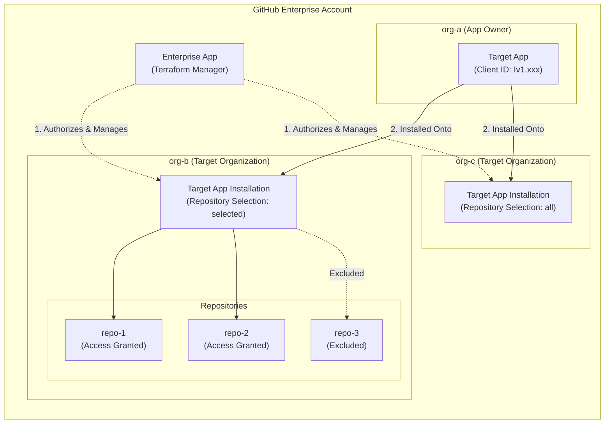

# Terraform Provider for GitHub App (Unofficial)

[](https://github.com/google/terraform-provider-gh-app-unofficial/actions/workflows/test.yml)
[](https://github.com/google/terraform-provider-gh-app-unofficial/actions/workflows/acceptance.yml)
[](https://opensource.org/licenses/MPL-2.0)
[](https://golang.org/doc/install)

A Terraform provider designed to manage GitHub App installations and repository configurations at enterprise scale. Built using the modern [Terraform Plugin Framework](https://github.com/hashicorp/terraform-plugin-framework).

Using this provider, platform and security teams can automate the installation, updating, and repository scoping of GitHub Apps across enterprise organizations declaratively, eliminating manual organization-level onboarding and personal access token sprawl.

---

## Why This Provider?

> Managing GitHub Apps across a multi-organization enterprise shouldn't require hundreds of personal access tokens or manual clicks.

### The Problem: The Enterprise Multi-Org Automation Gap
- **What is a GitHub App?**: GitHub Apps are first-class, dedicated machine identities. Unlike personal user accounts or Personal Access Tokens (PATs), GitHub Apps provide fine-grained scoped permissions, short-lived tokens, and explicit organization/repository boundaries. They are the industry standard for security scanners, CI/CD runners, and automation bots.
- **The Multi-Org Challenge**: In a GitHub Enterprise with dozens or hundreds of organizations, deploying a required GitHub App (such as a compliance auditor or dependency scanner) is difficult to automate. The official `integrations/github` Terraform provider only manages installations on a per-organization basis, requiring individual **Organization Owner Personal Access Tokens** for *every single organization*.
- **The Result**: Security teams and infrastructure engineers face personal access token sprawl, manual onboarding toil, and a lack of centralized governance over app topology.

### The Solution: Declarative Enterprise App Topology
This provider bridges that gap by leveraging GitHub Enterprise's enterprise-level installation APIs (`/enterprises/{enterprise}/...`):
- **Zero Token Sprawl**: Authenticate once using an enterprise-scoped administrative identity instead of collecting individual organization owner tokens.
- **Declarative App Topology**: Define exactly which organizations and repositories have access to your GitHub Apps directly in Terraform HCL code.
- **Continuous Drift Reconciliation**: Prevent out-of-band app uninstallations or permission modifications with standard `terraform plan` and `terraform apply`.
- **Cloud & On-Premises Parity**: Fully supports both **GitHub Enterprise Cloud (GHEC)** and self-hosted **GitHub Enterprise Server (GHES)**.

---

## App Topology Architecture

This diagram illustrates how an enterprise-level Manager App authorizes Terraform to deploy and scope a Target App across enterprise organizations:



---

## Requirements

- [Terraform](https://developer.hashicorp.com/terraform/downloads) >= 1.0

*(For developing, building, or contributing to the provider, see [DEVELOPMENT.md](./DEVELOPMENT.md) for Go and toolchain prerequisites).*

---

## Quick Start

### 1. Provider Configuration

Add the provider to your Terraform configuration:

```hcl
terraform {
  required_providers {
    gh-app-unofficial = {
      source  = "google/gh-app-unofficial"
      version = "~> 1.0"
    }
  }
}

provider "gh-app-unofficial" {
  enterprise_slug = "my-enterprise-slug"

  # Recommended: Provide authentication via the GITHUB_TOKEN environment variable:
  #   export GITHUB_TOKEN="<your-installation-access-token>"
  #
  # Or pass explicitly via a sensitive Terraform variable:
  # token = var.github_token

  # Optional: For GitHub Enterprise Server (on-premise) or custom API endpoints
  # (Defaults to https://api.github.com/). Can also be set via GITHUB_BASE_URL env var.
  # base_url = "https://github.mycompany.com"
}
```

### 2. Authentication & Configuration Parameters

| Attribute | Type | Required | Environment Variable | Description |
| :--- | :--- | :---: | :--- | :--- |
| `enterprise_slug` | String | **Yes** | — | The URL-friendly slug of your GitHub Enterprise account (e.g. `my-enterprise`). |
| `token` | String | No | `GITHUB_TOKEN` | A GitHub App Installation Access Token authorized with enterprise organization installation permissions. |
| `base_url` | String | No | `GITHUB_BASE_URL`, `GITHUB_ENTERPRISE_BASE_URL`, `GITHUB_API_URL` | The base URL for GitHub API requests. Defaults to `https://api.github.com/`. Set this when using GitHub Enterprise Server. |

---

## Resource Usage

### `gh-app-unofficial_installation`

Manages a GitHub App installation on a target organization within your enterprise.

#### Example: Install App with Access to Selected Repositories

```hcl
resource "gh-app-unofficial_installation" "security_scanner" {
  target_org            = "engineering-org"
  client_id             = "Iv1.0123456789abcdef"
  repository_selection  = "selected"
  selected_repositories = [
    "frontend-service",
    "backend-api",
    "infrastructure-core"
  ]
}

output "installation_id" {
  description = "The numeric ID of the app installation."
  value       = gh-app-unofficial_installation.security_scanner.installation_id
}
```

#### Example: Install App with Access to All Repositories

```hcl
resource "gh-app-unofficial_installation" "ci_bot" {
  target_org           = "engineering-org"
  client_id            = "Iv1.9876543210fedcba"
  repository_selection = "all"
}
```

#### Schema Summary

- **Required Attributes:**
  - `target_org` (String): The organization name where the GitHub App will be installed.
  - `client_id` (String): The Client ID of the GitHub App to install.
- **Optional Attributes:**
  - `repository_selection` (String): Repository access policy. Must be either `"all"` or `"selected"`. Defaults to `"all"`.
  - `selected_repositories` (Set of String): List of repository names the installation has access to. Required when `repository_selection = "selected"`.
- **Read-Only Attributes:**
  - `id` (String): Composite identifier in the format `<target_org>/<installation_id>`.
  - `installation_id` (String): Numeric GitHub installation ID.
  - `app_slug` (String): The URL slug of the installed GitHub App.
  - `permissions` (Map of String): Permissions granted to the app installation.
  - `events` (List of String): Webhook events configured for the app installation.
  - `created_at` (String): Creation timestamp.
  - `updated_at` (String): Last update timestamp.

#### Importing Existing Installations

Existing GitHub App installations can be imported into Terraform state using their composite identifier (`<target_org>/<installation_id>`):

```shell
terraform import gh-app-unofficial_installation.example "engineering-org/12345678"
```

---

## Data Source Usage

### `gh-app-unofficial_installations`

Queries and lists all GitHub Apps currently installed in a target organization.

```hcl
data "gh-app-unofficial_installations" "all_apps" {
  target_org = "engineering-org"
}

output "installed_app_slugs" {
  description = "Slugs of all GitHub Apps installed in the organization."
  value       = [for app in data.gh-app-unofficial_installations.all_apps.installations : app.app_slug]
}
```

---

## Common Recipes & Patterns

### Multi-Organization Rollout (`for_each`)

You can easily deploy a standardized security, compliance, or CI/CD GitHub App across multiple organizations:

```hcl
locals {
  target_orgs = toset([
    "payments-team",
    "identity-team",
    "data-platform"
  ])
}

resource "gh-app-unofficial_installation" "enterprise_audit" {
  for_each = local.target_orgs

  target_org           = each.key
  client_id            = var.audit_app_client_id
  repository_selection = "all"
}
```

### GitHub Enterprise Server (On-Premises)

When managing installations on a self-hosted GitHub Enterprise Server (GHES) instance:

```hcl
provider "gh-app-unofficial" {
  enterprise_slug = "internal-enterprise"
  base_url        = "https://github.corp.example.com"
  token           = var.ghes_manager_token
}
```

---

## Documentation

Full generated schema documentation for the provider, resources, and data sources is available in the [`docs/`](./docs) directory:
- [Provider Schema](./docs/index.md)
- [`gh-app-unofficial_installation` Resource](./docs/resources/installation.md)
- [`gh-app-unofficial_installations` Data Source](./docs/data-sources/installations.md)

---

## Development & Contributing

If you wish to contribute to the provider, run offline unit tests, execute live acceptance tests against a sandbox organization, or debug using VS Code and Delve (`dlv`), please see our comprehensive developer guide in **[DEVELOPMENT.md](./DEVELOPMENT.md)**.


For guidelines on contributor license agreements, code reviews, and our code of conduct, please review **[CONTRIBUTING.md](./CONTRIBUTING.md)**.

---

## License

This project is licensed under the [Mozilla Public License 2.0 (MPL-2.0)](./LICENSE).

---

> [!NOTE]
> **Disclaimer:** This is an unofficial Terraform provider and is not an officially supported Google LLC or GitHub product.


