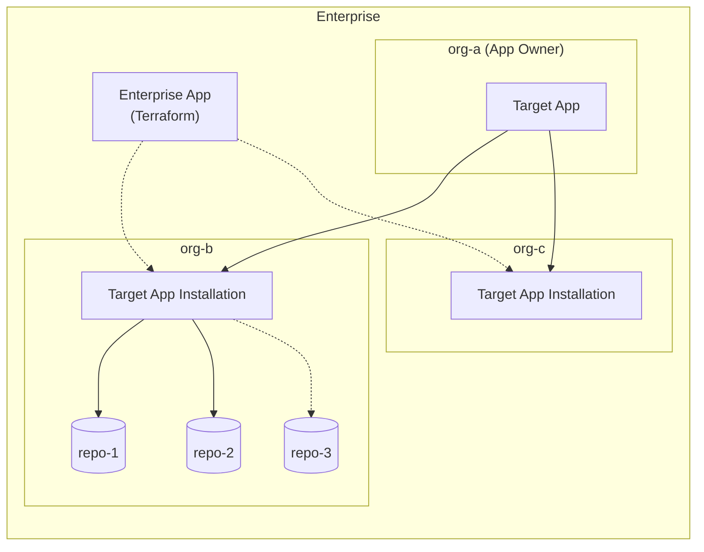

# Terraform Provider for GitHub App (Unofficial)

[](https://github.com/google/terraform-provider-gh-app-unofficial/actions/workflows/test.yml)
[](https://github.com/google/terraform-provider-gh-app-unofficial/actions/workflows/acceptance.yml)
[](https://github.com/google/terraform-provider-gh-app-unofficial/releases)
[](https://opensource.org/licenses/MPL-2.0)
[](https://golang.org/doc/install)

A Terraform provider designed to manage GitHub App installations and repository configurations at enterprise scale. Built using the modern [Terraform Plugin Framework](https://github.com/hashicorp/terraform-plugin-framework).

Using this provider, platform and security teams can automate the installation, updating, and repository scoping of GitHub Apps across enterprise organizations declaratively, eliminating manual organization-level onboarding and personal access token sprawl.

---

## Why This Provider?

> Managing GitHub Apps across a multi-organization enterprise shouldn't require hundreds of personal access tokens or manual UI clicks.

### The Problem: The Missing App Installation Resource
- **What is a GitHub App?**: GitHub Apps are first-class, dedicated machine identities with fine-grained permissions, short-lived tokens, and explicit repository boundaries. They are the security gold standard for CI/CD runners, compliance scanners, and automated bots.
- **The Gap in Official Tooling**: The official `integrations/github` Terraform provider **cannot install or uninstall GitHub Apps**. It lacks a resource to create or delete app installations (`resource "github_app_installation"` does not exist in the official provider). It only offers `github_app_installation_repositories`, which can only attach repositories to an app that an administrator has *already manually installed through the GitHub web UI*.
- **The Multi-Org Challenge**: In a GitHub Enterprise with dozens or hundreds of organizations, deploying a required security app across every organization requires either repetitive manual clicking in the web UI for every organization, or managing dozens of individual Organization Owner Personal Access Tokens (PATs) across separate provider blocks.

### The Solution: Declarative Enterprise App Topology
This provider bridges that gap by leveraging GitHub Enterprise's enterprise-level installation APIs (`/enterprises/{enterprise}/...`):
- **Automated Installation Lifecycle**: Declare and manage the full installation lifecycle (`gh-app-unofficial_installation`), provisioning and uninstalling GitHub Apps across any enterprise organization automatically.
- **Zero Token Sprawl**: Authenticate once using an enterprise-scoped administrative identity instead of maintaining individual organization owner tokens.
- **Declarative App Topology**: Define exactly which organizations and repositories have access to your GitHub Apps (`all` vs `selected` repositories) directly in Terraform HCL code.
- **Continuous Drift Reconciliation**: Prevent out-of-band app uninstallations or repository scope changes with standard `terraform plan` and `terraform apply`.
- **Cloud & On-Premises Parity**: Fully supports both **GitHub Enterprise Cloud (GHEC)** and self-hosted **GitHub Enterprise Server (GHES)**.

---

## App Topology Architecture

This diagram illustrates how an Enterprise Manager App authorizes Terraform to deploy and scope a Target App across enterprise organizations:



---

## Requirements

- [Terraform](https://developer.hashicorp.com/terraform/downloads) >= 1.0

> [!TIP]
> **Using the Provider**: You do **not** need to clone this repository or install Go. Download pre-compiled provider binaries directly from [GitHub Releases](https://github.com/google/terraform-provider-gh-app-unofficial/releases) (see [Installation](#installation) below).
>
> **Developing / Contributing**: If you wish to compile from source, execute acceptance tests, or contribute, see [DEVELOPMENT.md](./DEVELOPMENT.md).

---

## Installation

Pre-compiled binaries for Linux, macOS, and Windows are available on [GitHub Releases](https://github.com/google/terraform-provider-gh-app-unofficial/releases/latest).

Because this provider is distributed as an **unofficial release** (and not published to HashiCorp's public registry), select the installation method that fits your workflow:

### Option A: Quick Local Setup (Recommended for Developers)

The fastest way to use the provider locally is using Terraform's `dev_overrides`, which runs the binary directly without requiring `terraform init` or complex directories:

1. Download the release binary for your operating system and place it in a local directory (e.g. `~/bin` or `~/go/bin`):
   ```bash
   mkdir -p ~/bin
   # Download and extract the release binary into ~/bin/terraform-provider-gh-app-unofficial
   ```

2. Add a `dev_overrides` block to your `~/.terraformrc` (or `%APPDATA%\terraform.rc` on Windows):
   ```hcl
   provider_installation {
     dev_overrides {
       "google/gh-app-unofficial" = "/path/to/your/home/bin"
     }
     direct {}
   }
   ```

3. Run `terraform plan` or `terraform apply` directly in your project. Terraform will execute the local binary immediately (bypassing `terraform init`).

---

### Option B: Production & CI/CD Pipelines (GitHub Actions)

For automated CI/CD pipelines (e.g. GitHub Actions, Cloud Build) and production repositories that require `terraform init`, version pinning, and `.terraform.lock.hcl` verification, configure a filesystem mirror in your workflow:

```yaml
- name: Setup Terraform Provider Mirror
  shell: bash
  run: |
    # 1. Download and extract binary into local plugin mirror
    TARGET_DIR="${HOME}/.terraform.d/plugins/registry.terraform.io/google/gh-app-unofficial/0.1.0/linux_amd64"
    mkdir -p "${TARGET_DIR}"
    gh release download v0.1.0 --repo "google/terraform-provider-gh-app-unofficial" --pattern "*_linux_amd64.zip" --dir "/tmp"
    unzip -o "/tmp/"*_linux_amd64.zip -d "${TARGET_DIR}"

    # 2. Configure CLI to use local filesystem mirror
    cat << EOF > ~/.terraformrc
    provider_installation {
      filesystem_mirror {
        path    = "${HOME}/.terraform.d/plugins"
        include = ["registry.terraform.io/google/gh-app-unofficial"]
      }
      direct {
        exclude = ["registry.terraform.io/google/gh-app-unofficial"]
      }
    }
    EOF

- name: Terraform Init
  run: terraform init
```

> [!NOTE]
> For a detailed guide on managing cross-platform lockfiles and advanced CLI options, see [DEVELOPMENT.md](./DEVELOPMENT.md#4-provider-installation--cli-configuration).

---

## Quick Start

### 1. Provider Configuration

Add the provider to your Terraform configuration:

```hcl
terraform {
  required_providers {
    gh-app-unofficial = {
      source  = "google/gh-app-unofficial"
      version = ">= 0.1.0" # Match the version of your downloaded release binary
    }
  }
}

provider "gh-app-unofficial" {
  enterprise_slug = "my-enterprise-slug"

  # Recommended: Provide authentication via the GITHUB_TOKEN environment variable:
  #   export GITHUB_TOKEN="<your-installation-access-token>"
  #
  # Or pass explicitly via a sensitive Terraform variable:
  # token = var.github_token

  # Optional: For GitHub Enterprise Server (on-premise) or custom API endpoints
  # (Defaults to https://api.github.com/). Can also be set via GITHUB_BASE_URL env var.
  # base_url = "https://github.mycompany.com"
}
```

### 2. Authentication & Configuration Parameters

| Attribute | Type | Required | Environment Variable | Description |
| :--- | :--- | :---: | :--- | :--- |
| `enterprise_slug` | String | **Yes** | — | The URL-friendly slug of your GitHub Enterprise account (e.g. `my-enterprise`). |
| `token` | String | No | `GITHUB_TOKEN` | A GitHub App Installation Access Token authorized with enterprise organization installation permissions. |
| `base_url` | String | No | `GITHUB_BASE_URL`, `GITHUB_ENTERPRISE_BASE_URL`, `GITHUB_API_URL` | The base URL for GitHub API requests. Defaults to `https://api.github.com/`. Set this when using GitHub Enterprise Server. |

---

## Resource Usage

### `gh-app-unofficial_installation`

Manages a GitHub App installation on a target organization within your enterprise.

#### Example: Install App with Access to Selected Repositories

```hcl
resource "gh-app-unofficial_installation" "security_scanner" {
  target_org            = "engineering-org"
  client_id             = "Iv1.0123456789abcdef"
  repository_selection  = "selected"
  selected_repositories = [
    "frontend-service",
    "backend-api",
    "infrastructure-core"
  ]
}

output "installation_id" {
  description = "The numeric ID of the app installation."
  value       = gh-app-unofficial_installation.security_scanner.installation_id
}
```

#### Example: Install App with Access to All Repositories

```hcl
resource "gh-app-unofficial_installation" "ci_bot" {
  target_org           = "engineering-org"
  client_id            = "Iv1.9876543210fedcba"
  repository_selection = "all"
}
```

#### Schema Summary

- **Required Attributes:**
  - `target_org` (String): The organization name where the GitHub App will be installed.
  - `client_id` (String): The Client ID of the GitHub App to install.
- **Optional Attributes:**
  - `repository_selection` (String): Repository access policy. Must be either `"all"` or `"selected"`. Defaults to `"all"`.
  - `selected_repositories` (Set of String): List of repository names the installation has access to. Required when `repository_selection = "selected"`.
- **Read-Only Attributes:**
  - `id` (String): Composite identifier in the format `<target_org>/<installation_id>`.
  - `installation_id` (String): Numeric GitHub installation ID.
  - `app_slug` (String): The URL slug of the installed GitHub App.
  - `permissions` (Map of String): Permissions granted to the app installation.
  - `events` (List of String): Webhook events configured for the app installation.
  - `created_at` (String): Creation timestamp.
  - `updated_at` (String): Last update timestamp.

#### Importing Existing Installations

Existing GitHub App installations can be imported into Terraform state using their composite identifier (`<target_org>/<installation_id>`):

```shell
terraform import gh-app-unofficial_installation.example "engineering-org/12345678"
```

---

## Data Source Usage

### `gh-app-unofficial_installations`

Queries and lists all GitHub Apps currently installed in a target organization.

```hcl
data "gh-app-unofficial_installations" "all_apps" {
  target_org = "engineering-org"
}

output "installed_app_slugs" {
  description = "Slugs of all GitHub Apps installed in the organization."
  value       = [for app in data.gh-app-unofficial_installations.all_apps.installations : app.app_slug]
}
```

---

## Common Recipes & Patterns

### Multi-Organization Rollout (`for_each`)

You can easily deploy a standardized security, compliance, or CI/CD GitHub App across multiple organizations:

```hcl
locals {
  target_orgs = toset([
    "payments-team",
    "identity-team",
    "data-platform"
  ])
}

resource "gh-app-unofficial_installation" "enterprise_audit" {
  for_each = local.target_orgs

  target_org           = each.key
  client_id            = var.audit_app_client_id
  repository_selection = "all"
}
```

### GitHub Enterprise Server (On-Premises)

When managing installations on a self-hosted GitHub Enterprise Server (GHES) instance:

```hcl
provider "gh-app-unofficial" {
  enterprise_slug = "internal-enterprise"
  base_url        = "https://github.corp.example.com"
  token           = var.ghes_manager_token
}
```

---

## Documentation

Full generated schema documentation for the provider, resources, and data sources is available in the [`docs/`](./docs) directory:
- [Provider Schema](./docs/index.md)
- [`gh-app-unofficial_installation` Resource](./docs/resources/installation.md)
- [`gh-app-unofficial_installations` Data Source](./docs/data-sources/installations.md)

---

## Development & Contributing

If you wish to contribute to the provider, run offline unit tests, execute live acceptance tests against a sandbox organization, or debug using VS Code and Delve (`dlv`), please see our comprehensive developer guide in **[DEVELOPMENT.md](./DEVELOPMENT.md)**.


For guidelines on contributor license agreements, code reviews, and our code of conduct, please review **[CONTRIBUTING.md](./CONTRIBUTING.md)**.

---

## License & Disclaimer

This project is licensed under the [Mozilla Public License 2.0 (MPL-2.0)](./LICENSE).

*Disclaimer: This is an unofficial Terraform provider and is not an officially supported Google LLC or GitHub product.*


